# Pure Roll Mode of an Aircraft / Modo de Rolamento Puro de uma Aeronave

Interactive presentation and explanatory material on the **Modeling, Equation of Motion, and Transfer Function** of the Pure Roll Mode in aircraft flight dynamics.

Apresentação interativa e material explicativo sobre a **Modelagem, Equação de Movimento e Função de Transferência** do Modo de Rolamento Puro em dinâmica de voo de aeronaves.

---

## 💡 Repository Descriptions / Descrições do Repositório

*(Options for repository description / Opções para a descrição curta do repositório no GitHub)*

- **EN**: Interactive presentation & simulation of Aircraft Pure Roll Mode dynamics, ODE modeling, and Transfer Function (Schmidt, 1998).
- **PT**: Apresentação interativa e simulação da dinâmica do Modo de Rolamento Puro de aeronaves, modelagem por EDO e Função de Transferência.

---

# 🇬🇧 English Version

## 📌 About the Project

This project features an interactive HTML/CSS/JS presentation designed to illustrate the core concepts of lateral-directional flight dynamics in aircraft, focusing specifically on the **Pure Roll Mode**.

The theoretical background is based on the classical textbook:
> **SCHMIDT, Louis V.** *Introduction to Aircraft Flight Dynamics*. AIAA Education Series, 1998 (Chapter 7, Section 7.2: *Pure Rolling Motion* - Equations 7.1 to 7.9).

### 📐 Key Topics Covered

1. **Context — Lateral-Directional Dynamics**: State variables ($\beta, p, \phi, r$) and decomposition into three dynamic modes (*Dutch-roll*, *Roll*, and *Spiral*).
2. **Assumptions & Equation of Motion**: Derivation of Equation (7.1) from angular momentum conservation along the stability $x$-axis:
   $$\dot{p} = L_p p(t) + L_{\delta_a} \delta_a(t)$$
3. **System Block Diagram**: Feedback control loop representation highlighting control gains ($L_{\delta_a}$), integrator ($1/s$), and aerodynamic damping ($L_p$).
4. **General Solution & Step Response**: Analytical solution of the 1st-order ODE and step response:
   $$p(t) = p_{\text{stat}} (1 - e^{-t/\tau})$$
   including DC-8 numerical data ($M=0.84$, $h=33,000\text{ ft}$, $\tau = 0.845\text{ s}$, $p_{\text{stat}} = 8.96^\circ/\text{s}$).
5. **Aileron Pulse Response**: Bank angle variation ($\Delta\phi(t)$) and asymptotic value $\Delta\phi_\infty = p_{\text{stat}} \cdot T$.
6. **Frequency Response**: Analysis as a 1st-order low-pass filter ($G(\omega) = \frac{1}{\sqrt{1 + (\omega\tau)^2}}$) with cutoff frequency $\omega_c = 1/\tau$.
7. **From ODE to Laplace Transform**: Step-by-step application of Laplace Transform to derive the Transfer Function.
8. **Transfer Function $G_p(s)$ & $s$-Plane**: Pole analysis $s = L_p < 0$ in the left half-plane, ensuring asymptotic stability.

---

## 🚀 How to Open and Run

1. **Directly in Browser**:
   - Download or clone this repository.
   - Double-click `rolamento_puro_aeronave.html` or open it in any modern browser (Chrome, Firefox, Edge, Safari).

2. **Slide Navigation & Interactive Controls**:
   - Use keyboard **arrow keys** ($\leftarrow$ / $\rightarrow$) or **spacebar** to move through the slides.
   - Interact with the embedded live simulations (aileron deflection buttons, sliders for time constant $\tau$, pulse duration $T$, and frequency $\omega$).

---

## 📸 Slide Gallery / Galeria de Slides

### Slide 1: Cover / Capa
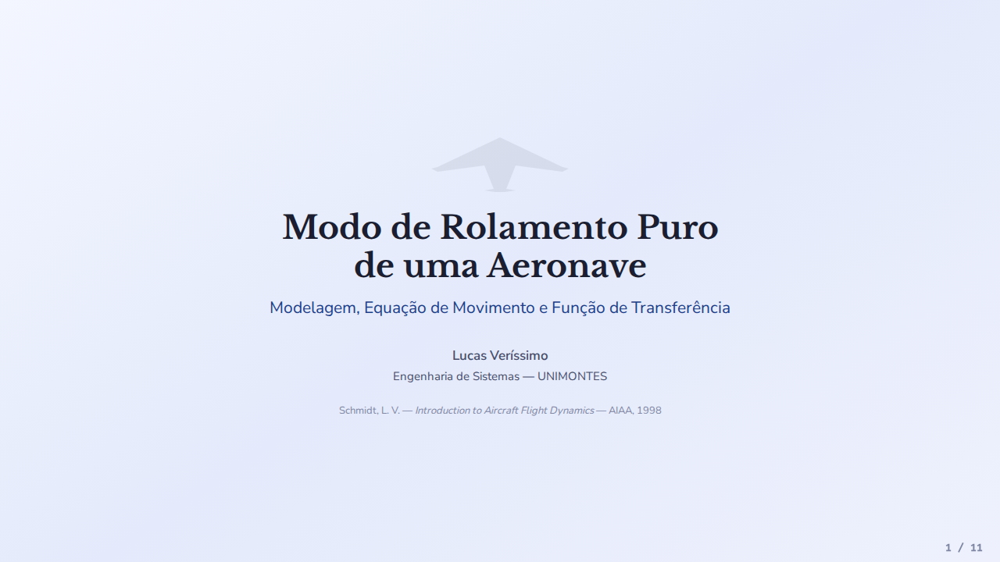

### Slide 2: Table of Contents / Sumário
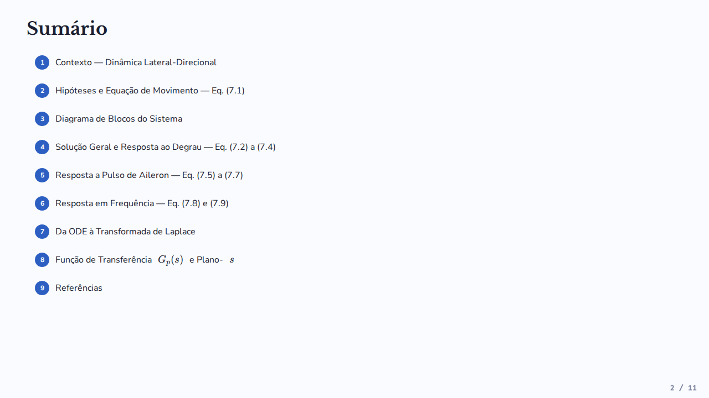

### Slide 3: Context — Lateral-Directional Dynamics / Contexto
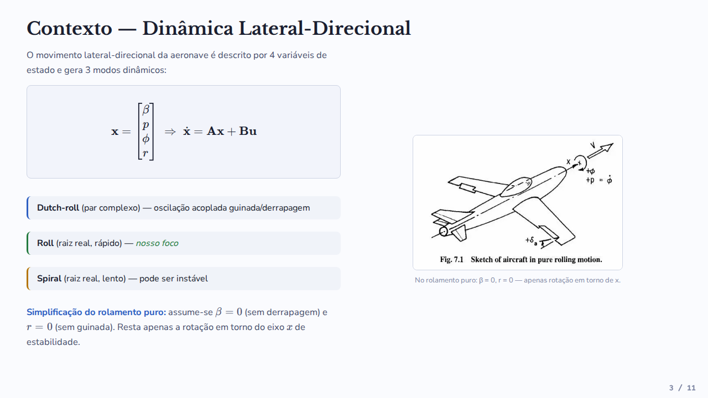

### Slide 4: Assumptions & Equation of Motion / Hipóteses e Eq. de Movimento
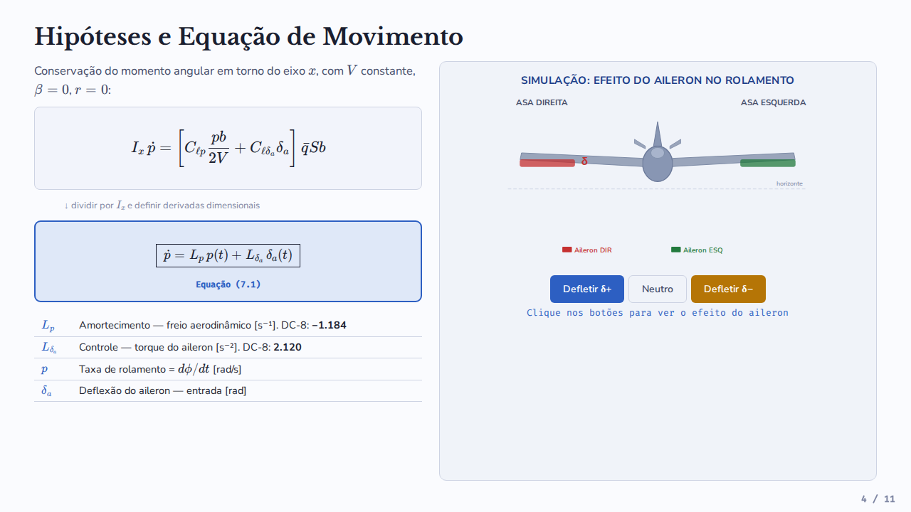

### Slide 5: System Block Diagram / Diagrama de Blocos
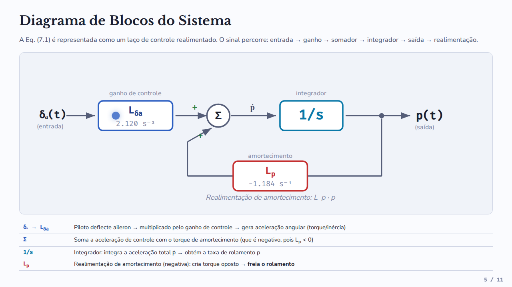

### Slide 6: General Solution & Step Response / Resposta ao Degrau
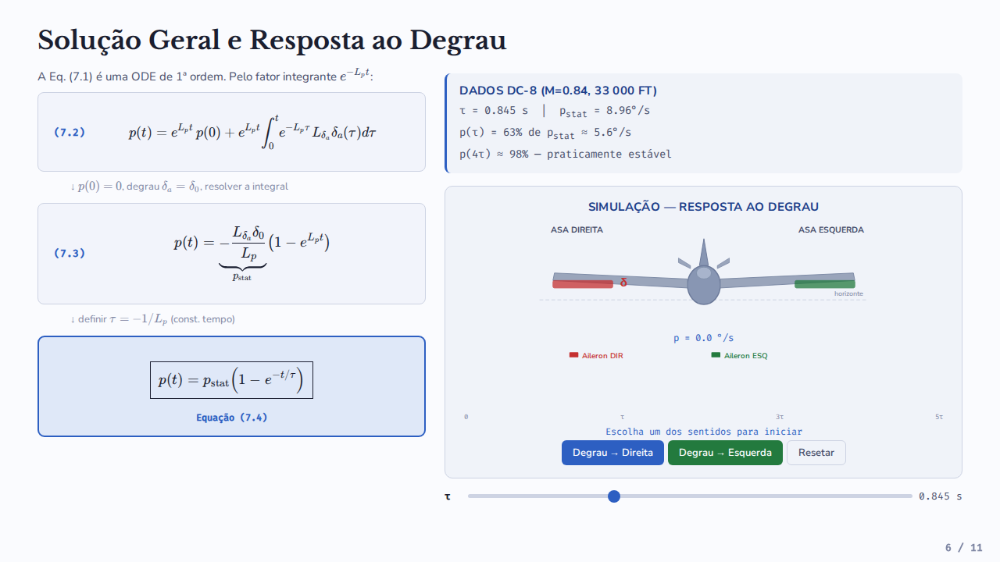

### Slide 7: Aileron Pulse Response / Resposta a Pulso
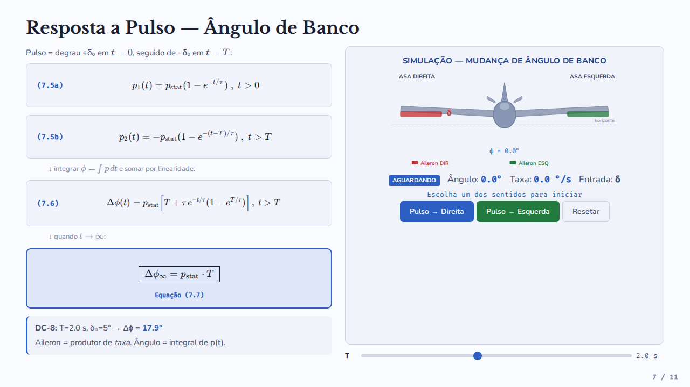

### Slide 8: Frequency Response / Resposta em Frequência
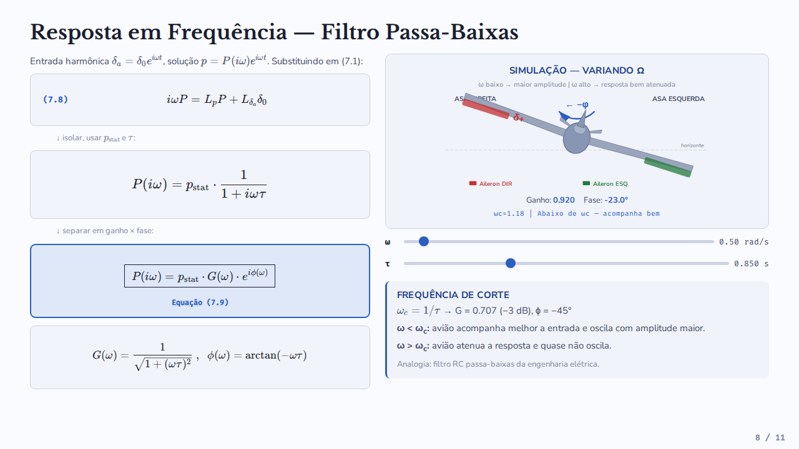

### Slide 9: From ODE to Laplace Transform / Da EDO a Laplace
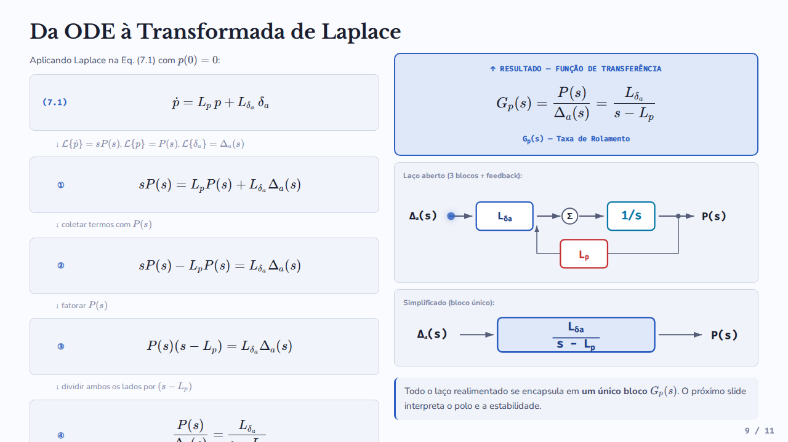

### Slide 10: Transfer Function & $s$-Plane / Função de Transferência
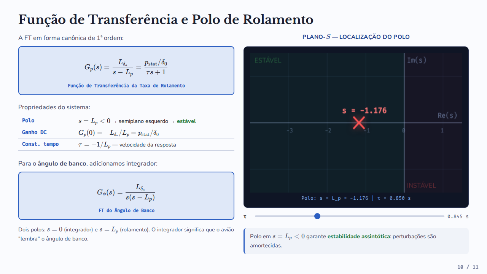

### Slide 11: References & Credits / Referências
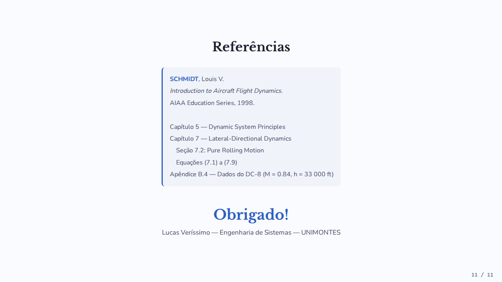

---

## 👤 Author & Credits

- **Author**: Lucas Veríssimo
- **Degree**: Systems Engineering — State University of Montes Claros (UNIMONTES)

---
---

# 🇧🇷 Versão em Português

## 📌 Sobre o Projeto

Este projeto consiste em uma apresentação interativa em formato HTML/CSS/JS desenvolvida para ilustrar os conceitos fundamentais da dinâmica lateral-direcional de aeronaves, focando especificamente no **Modo de Rolamento Puro**.

A apresentação foi elaborada com base na obra clássica:
> **SCHMIDT, Louis V.** *Introduction to Aircraft Flight Dynamics*. AIAA Education Series, 1998 (Capítulo 7, Seção 7.2: *Pure Rolling Motion* - Equações 7.1 a 7.9).

### 📐 Conteúdo Coberto

1. **Contexto — Dinâmica Lateral-Direcional**: Variáveis de estado ($\beta, p, \phi, r$) e decomposição nos três modos dinâmicos (*Dutch-roll*, *Roll* e *Spiral*).
2. **Hipóteses e Equação de Movimento**: Dedução da Equação (7.1) a partir da conservação do momento angular em torno do eixo $x$ de estabilidade:
   $$\dot{p} = L_p p(t) + L_{\delta_a} \delta_a(t)$$
3. **Diagrama de Blocos do Sistema**: Representação em laço de controle realimentado destacando os ganhos de controle ($L_{\delta_a}$), integrador ($1/s$) e amortecimento aerodinâmico ($L_p$).
4. **Solução Geral e Resposta ao Degrau**: Solução analítica da ODE de 1ª ordem e resposta ao degrau de aileron:
   $$p(t) = p_{\text{stat}} (1 - e^{-t/\tau})$$
   com dados numéricos da aeronave **DC-8** ($M=0.84$, $h=33.000\text{ ft}$, $\tau = 0.845\text{ s}$, $p_{\text{stat}} = 8.96^\circ/\text{s}$).
5. **Resposta a Pulso de Aileron**: Cálculo da variação do ângulo de banco ($\Delta\phi(t)$) e valor assintótico $\Delta\phi_\infty = p_{\text{stat}} \cdot T$.
6. **Resposta em Frequência**: Análise como filtro passa-baixas de 1ª ordem ($G(\omega) = \frac{1}{\sqrt{1 + (\omega\tau)^2}}$) e frequência de corte $\omega_c = 1/\tau$.
7. **Da ODE à Transformada de Laplace**: Passo a passo da aplicação da Transformada de Laplace para obtenção da Função de Transferência.
8. **Função de Transferência $G_p(s)$ e Plano-$s$**: Análise do polo $s = L_p < 0$ no semiplano esquerdo, garantindo estabilidade assintótica.

---

## 🚀 Como Abrir e Executar

1. **Via Navegador Web (Direto)**:
   - Baixe ou clone este repositório.
   - Dê um duplo clique no arquivo `rolamento_puro_aeronave.html` ou abra-o em qualquer navegador moderno (Google Chrome, Mozilla Firefox, Microsoft Edge, Safari, etc.).

2. **Navegação no Slide Interativo**:
   - Utilize as **setas do teclado** ($\leftarrow$ / $\rightarrow$) ou a **barra de espaço** para avançar/retroceder entre os slides.
   - Utilize os controles interativos nas simulações (botões de deflexão de aileron, sliders de constante de tempo $\tau$, duração de pulso $T$ e frequência $\omega$).

---

## 👤 Autoria e Créditos

- **Autor**: Lucas Veríssimo
- **Curso**: Engenharia de Sistemas — Universidade Estadual de Montes Claros (UNIMONTES)
