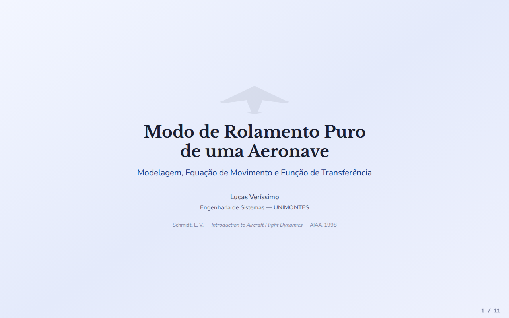

# Modo de Rolamento Puro de uma Aeronave

Apresentação interativa e material explicativo sobre a **Modelagem, Equação de Movimento e Função de Transferência** do Modo de Rolamento Puro (*Pure Roll Mode*) em dinâmica de voo de aeronaves.

---

## 📌 Sobre o Projeto

Este projeto consiste em uma apresentação interativa em formato HTML/CSS/JS desenvolvida para ilustrar os conceitos fundamentais da dinâmica lateral-direcional de aeronaves, focando especificamente no **Modo de Rolamento Puro**.

A apresentação foi elaborada com base na obra clássica:
> **SCHMIDT, Louis V.** *Introduction to Aircraft Flight Dynamics*. AIAA Education Series, 1998 (Capítulo 7, Seção 7.2: *Pure Rolling Motion* - Equações 7.1 a 7.9).

### 📐 Conteúdo Coberto

1. **Contexto — Dinâmica Lateral-Direcional**: Variáveis de estado ($\beta, p, \phi, r$) e decomposição nos três modos dinâmicos (*Dutch-roll*, *Roll* e *Spiral*).
2. **Hipóteses e Equação de Movimento**: Dedução da Equação (7.1) a partir da conservação do momento angular em torno do eixo $x$ de estabilidade:
   $$\dot{p} = L_p p(t) + L_{\delta_a} \delta_a(t)$$
3. **Diagrama de Blocos do Sistema**: Representação em laço de controle realimentado destacando os ganhos de controle ($L_{\delta_a}$), integrador ($1/s$) e amortecimento aerodinâmico ($L_p$).
4. **Solução Geral e Resposta ao Degrau**: Solução analítica da ODE de 1ª ordem e resposta ao degrau de aileron:
   $$p(t) = p_{\text{stat}} (1 - e^{-t/\tau})$$
   com dados numéricos da aeronave **DC-8** ($M=0.84$, $h=33.000\text{ ft}$, $\tau = 0.845\text{ s}$, $p_{\text{stat}} = 8.96^\circ/\text{s}$).
5. **Resposta a Pulso de Aileron**: Cálculo da variação do ângulo de banco ($\Delta\phi(t)$) e valor assintótico $\Delta\phi_\infty = p_{\text{stat}} \cdot T$.
6. **Resposta em Frequência**: Análise como filtro passa-baixas de 1ª ordem ($G(\omega) = \frac{1}{\sqrt{1 + (\omega\tau)^2}}$) e frequência de corte $\omega_c = 1/\tau$.
7. **Da ODE à Transformada de Laplace**: Passo a passo da aplicação da Transformada de Laplace para obtenção da Função de Transferência.
8. **Função de Transferência $G_p(s)$ e Plano-$s$**: Análise do polo $s = L_p < 0$ no semiplano esquerdo, garantindo estabilidade assintótica.

---

## 📸 Demonstração

---

## 🚀 Como Abrir e Executar

1. **Via Navegador Web (Direto)**:
   - Baixe ou clone este repositório.
   - Dê um duplo clique no arquivo `rolamento_puro_aeronave.html` ou abra-o em qualquer navegador moderno (Google Chrome, Mozilla Firefox, Microsoft Edge, Safari, etc.).

2. **Navegação no Slide Interativo**:
   - Utilize as **setas do teclado** ($\leftarrow$ / $\rightarrow$) ou a **barra de espaço** para avançar/retroceder entre os slides.
   - Utilize os controles interativos nas simulações (botões de deflexão de aileron, sliders de constante de tempo $\tau$, duração de pulso $T$ e frequência $\omega$).

---

## 👤 Autoria e Créditos

- **Autor**: Lucas Veríssimo
- **Curso**: Engenharia de Sistemas — Universidade Estadual de Montes Claros (UNIMONTES)
